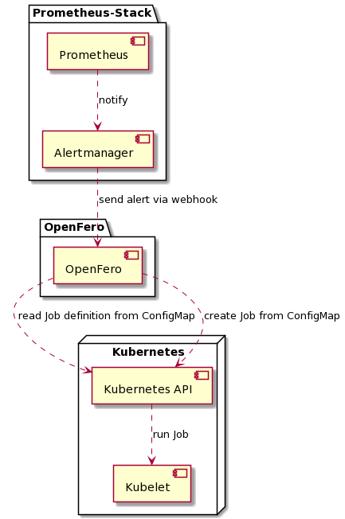

# OpenFero

Open Fero is a little play on words from the Latin "opem fero", which means "to help" and the term "OpenSource". Hence the name "openfero". The scope of OpenFero is a framework for self-healing in a cloud-native environment.

[![OpenSSF Scorecard]
(https://api.securityscorecards.dev/projects/github.com/Payback159/openfero/badge)]
(https://api.securityscorecards.dev/projects/github.com/Payback159/openfero)

## Local development

```bash
export KUBE_VERSION=v1.17.17
export PROM_OPERATOR_VERSION=13.2.1

brew install kind
kind create cluster --image kindest/node:${KUBE_VERSION}
helm install mmop prometheus-community/kube-prometheus-stack --namespace default --set kubeTargetVersionOverride="${KUBE_VERSION}" --version=${PROM_OPERATOR_VERSION}
```

## build image

```bash
make build
```

## Test-Case

```bash
curl -X POST -H "Content-Type: application/json" -d @./test/alerts.json http://localhost:8080/alerts
```

## Component-Diagram

[]()

## Job definitions

The job definitions are stored in the namespace in ConfigMaps with the naming convention `openfero-<alertname>-<status>`.

### Example-Names

* `openfero-KubeQuotaAlmostReached-firing`
* `openfero-KubeQuotaAlmostReached-resolved`

### Job-Example

```yaml
apiVersion: batch/v1
kind: Job
metadata:
  name: openfero-kubequotaalmostfull-firing
  labels:
    app: openfero
spec:
  parallelism: 1
  completions: 1
  template:
      labels:
        app: openfero
      spec:
        containers:
        - name: python-job
          image: python:latest
          args:
          - bash
          - -c
          - |-
            echo "Hallo Welt"
        imagePullPolicy: Always
        restartPolicy: Never
        serviceAccount: <desired-sa>
        serviceAccountName: <desired-sa>
```

## Security note

The service account that is installed when deploying openfero is for openfero itself. For the jobs, separate service accounts must be rolled out, which have the appropriate permissions for the job.

For jobs that need to interact with the Kubernetes API, it is recommended to define a suitable role for the job and authorize it via ServiceAccount in the job definition.
