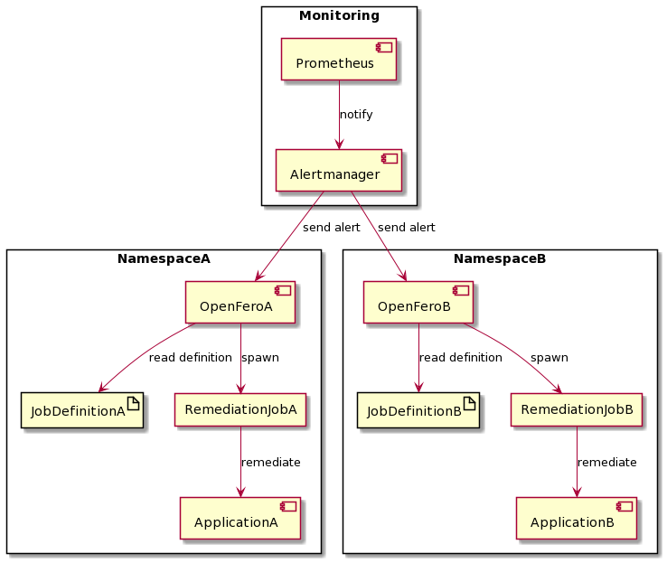

# Installation Recommendations

Since remediation often needs to be close to the system that needs the remediation. It is recommended to run the OpenFero component close to the system. The component itself has a small resource footprint and can run in parallel to the observed system in the namespace.

## Recommendation-1

